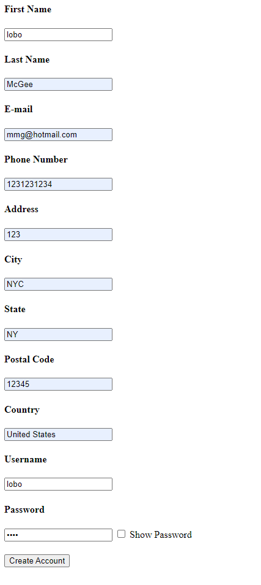
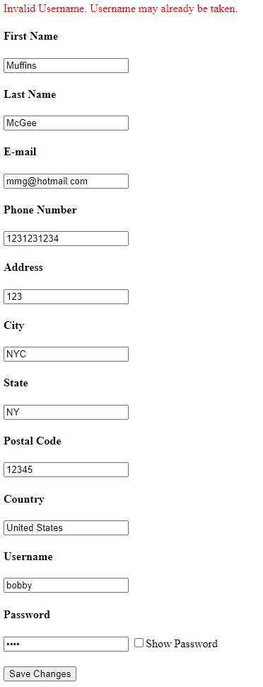
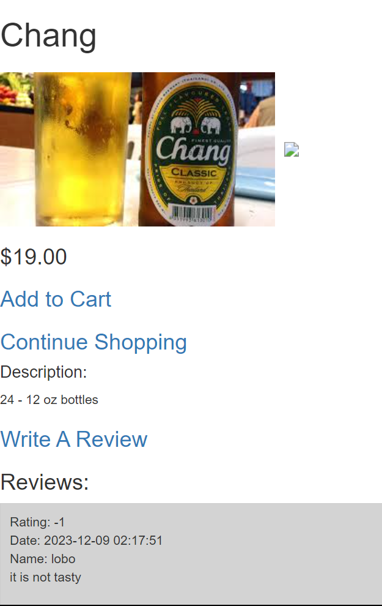
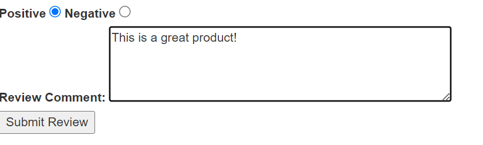
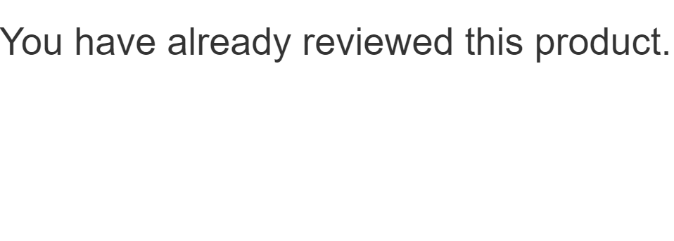
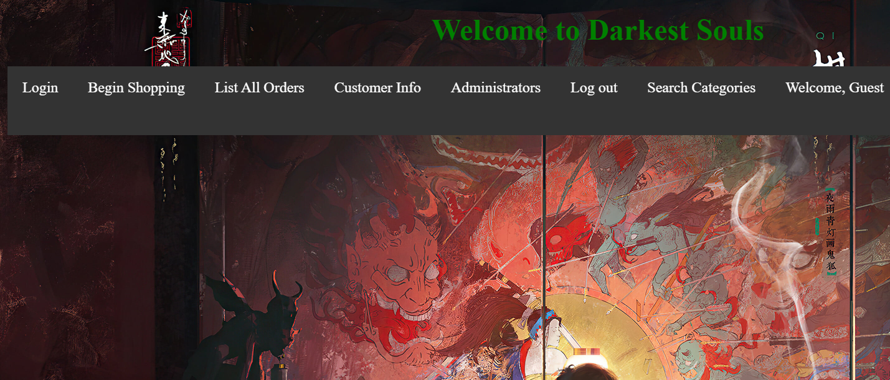
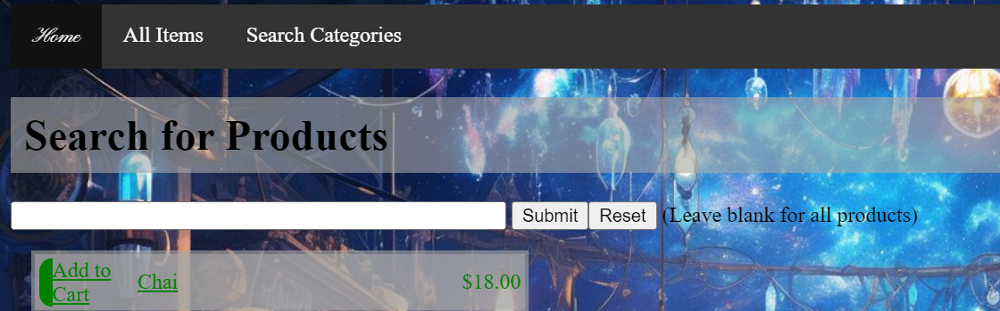
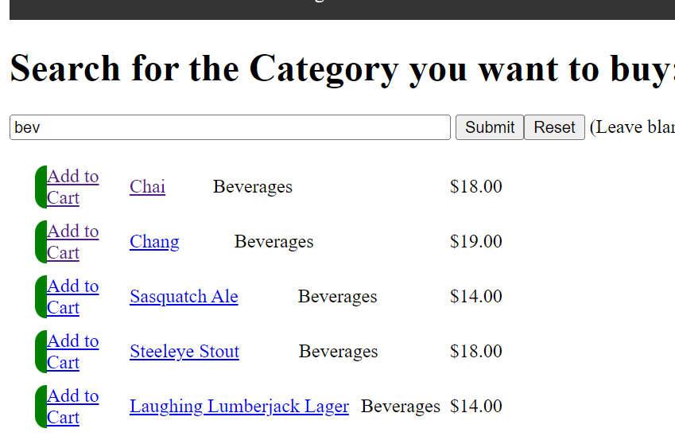

# Darkest Souls
## Mission Statement
We want to cater for the spookiest of seasons when buyers are looking for topical and useful products. We are opening a seasonal online store that features several Halloween products.

## Executive Summary:
Welcome to our intriguing emporium, where the supernatural meets commerce in a spellbinding fusion of mystique and merchandise. At the heart of our collection are our exclusive literal demon souls, jarred and accompanied by a certificate affirming their genuine origin.

Discover the arcane secrets within our potion books, and source your mystical ingredients, from rabbit's foot to nightshade, to brew your own enchantments. Elevate your experience with our high-end offerings—spirit wave detectors, certified possessed dolls, and vintage Ouija boards, each carrying an aura of the unknown.

Our products, inherently tied to dangerous auras, command a premium, reflecting their rarity and allure. Beyond retail, our services include a nominal charge for the secure relocation of haunted entities, ensuring a seamless transition between realms.

Join us in exploring the extraordinary as we bridge the gap between the supernatural and the tangible, offering a curated selection that promises to enthrall and captivate seekers of the mysterious.

## Features

### Core Features 29pts

All core features were implemented in labs 7 and 8.

### Create User Account Page AND Create Account with Data Validation 4pts

To access the page, the user will first enter the login page. They will then see the *Create Account* link that will redirect them to the **accountcreation.jsp** 

The account will not be created if the user leaves an entry blank or if the userId is already taken. The sql is handled as a transaction and will be rolledback if the account insertion was not done correctly. The user can then succesfully login to the site with their new account.

### Edit User Account Info 2pts

The user can edit their account by first going to **customer.jsp** and selecting *Edit Account* below their current information. The page is similar to the account creation page, but the attribues are already filled to their current values in the database. The account will not be updated if the requested userid is already taken.

### Product Reviews 5pts

The product page features all reviews for the corresponding product

if a user is signed in and on the product info page, the will see an option to *write a review*. 
This will redirect the user to the review page

If the user has already reviewed the product they will be notified

### Search Bar
The user can use the search bar from the home page to immediately search for products.

### Menu Bar
User have a menu bar to interact with on pages for direct access to common pages, with reaction to hover of mouse to let users see when an option appears.

### Shippping Review
When checking out, a shipping address confirmation will pop up, with the form being pre-filled with current users saved address. They may edit if they want.

### User name after login
After logging in, the menu will show the logged in users name as eg. "Welcome, Aaron". This will change to "Welcome guest" when not signed in.

### Category Search
Users have an option to search for products by category. This will reurn all products within that category, or similar to what has been entered by user.

## Sources Used 3pts

We have used:

- Chat Gpt
- JetBrains Copilot
